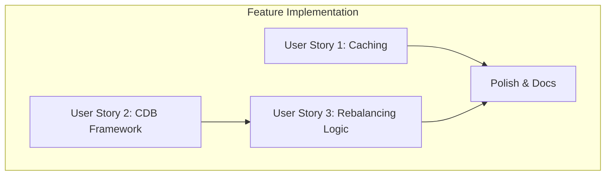

# Implementation Tasks: CDB Scenario and Data Persistence

**Feature**: CDB Scenario and Data Persistence

This document breaks down the implementation of the feature into actionable, developer-focused tasks. The tasks are organized by user story to facilitate incremental development and testing.

## Phase 1: Setup

- [x] T001 Create the `data/` directory in the project root for caching data files.

## Phase 2: User Story 1 - Data Caching & Persistence

- **Goal**: Implement a caching layer to store and retrieve financial data from local CSV files, avoiding redundant downloads.
- **Independent Test**: Run the script twice. The second run must be faster and show logs indicating cache usage.

- [x] T002 [US1] Use existing `DATA_UPDATE_DAYS` variable from `config.py` (originally was to add `DATA_CACHE_DAYS`).
- [x] T003 [P] [US1] In `data_loader.py`, create a helper function `_is_cache_valid(file_path)` that returns `True` if the file exists and its modification date is within `DATA_CACHE_DAYS`.
- [x] T004 [US1] Modify the `download_stock_data` function in `data_loader.py`. It should check for a valid cached file using `_is_cache_valid` before downloading from `yfinance`. If data is downloaded, it must be saved to `data/{ticker}.csv`.
- [x] T005 [US1] Modify `get_selic` and `get_ipca` in `data_loader.py` to use the same caching logic, reading from and saving to `data/SELIC.csv` and `data/IPCA.csv` respectively.
- [x] T006 [US1] In `tests/test_data_loader.py`, add new tests to verify the caching mechanism. Mock `os.path.getmtime` and `yfinance.download` to test that data is correctly read from cache and that downloads are skipped when the cache is valid.

## Phase 3: User Story 2 - CDB/SELIC Investment Scenario Framework

- **Goal**: Create the framework for the new backtesting scenario and integrate it into the main application flow.
- **Independent Test**: Run the main script. A new Excel file and plot for the CDB scenario should be generated, even if the rebalancing logic is not yet complete.

- [x] T007 [P] [US2] Add the `CDB_PERCENTAGE` variable to `config.py` and set a default value (e.g., 0.25).
- [x] T008 [US2] In `scenarios.py`, create a new function `run_scenario_cdb_mixed(start_date, end_date, monthly_contribution, portfolio_data, selic_data, ipca_data, cdb_percentage)`. Add placeholder logic to return a basic DataFrame.
- [x] T009 [US2] In `main.py`, add a call to `scenarios.run_scenario_cdb_mixed` and handle its results.
- [x] T010 [P] [US2] In `plotting.py`, create a new function `plot_cdb_mixed_scenario(results_df)` that generates a capital curve plot for the CDB scenario.
- [x] T011 [US2] In `main.py`, call the new `plot_cdb_mixed_scenario` function.

## Phase 4: User Story 3 - CDB/SELIC Rebalancing Rule

- **Goal**: Implement the core investment logic for the CDB scenario, where monthly contributions are allocated based on the CDB asset's target percentage.
- **Independent Test**: The generated `backtest_results_cdb_mixed.xlsx` file must show that contributions are correctly allocated to the CDB asset when its value is below the target.

- [x] T012 [US3] In `scenarios.py`, inside `run_scenario_cdb_mixed`, implement the main loop that iterates through months.
- [x] T013 [US3] Within the loop in `run_scenario_cdb_mixed`, calculate the total portfolio value and the current percentage of the CDB asset.
- [x] T014 [US3] Implement the conditional logic: if the CDB asset percentage is below the `cdb_percentage` target, allocate the entire `monthly_contribution` to the CDB asset. Otherwise, allocate it to the stock with the lowest monetary value.
- [x] T015 [US3] In `tests/test_scenarios.py`, add new tests for `run_scenario_cdb_mixed`. Create mock dataframes and verify that the contribution allocation logic works as expected under different conditions (CDB below target and CDB above target).

## Phase 5: Polish & Documentation

- [x] T016 [P] Review and enhance all console log messages to ensure clarity, especially for cache hits/misses and scenario execution steps.
- [x] T017 [P] Update `GEMINI.md` or `README.md` to document the new data caching feature and the CDB/SELIC investment scenario, including the new `config.py` options.

## Dependencies & Execution Order

- **User Story 1 (Data Caching)** can be implemented independently.
- **User Story 2 (CDB Framework)** can be implemented independently of User Story 1.
- **User Story 3 (Rebalancing Logic)** depends on the completion of **User Story 2**.

## Parallel Execution

- Within each user story phase, tasks marked with `[P]` can often be worked on in parallel.
- **US1 and US2 can be developed in parallel**. One developer can work on the caching mechanism while another sets up the framework for the new CDB scenario.

## Implementation Strategy

The suggested MVP (Minimum Viable Product) is the completion of **User Story 1**, as it provides an immediate performance benefit to all existing scenarios. Following that, **User Story 2** and **User Story 3** should be completed together to deliver the full CDB scenario feature.